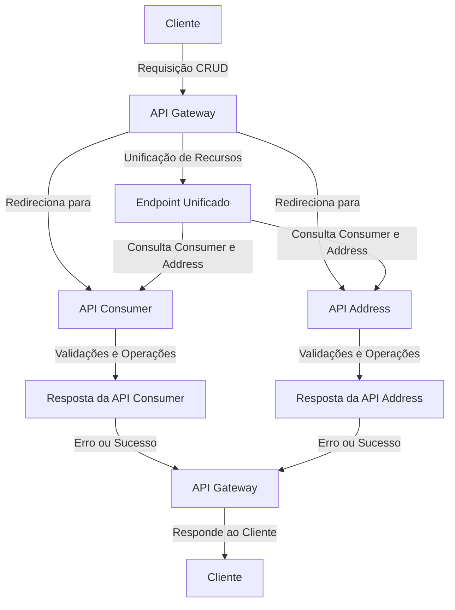

# Exemplo de Microsserviço

### Como testar

Para testar o projeto, é necessário executar os três projetos: `gateway`, `consumer-api` e `address-api` localmente.

Para realizar uma requisição, siga o padrão REST enviando a requisição para o `gateway` através da porta `8080`.

### Rotas:

**POST /consumer-address**

**Body:**
```json
{
  "name": "João da Silva",
  "age": 30,
  "email": "joao.silva@example.com",
  "address": {
    "street": "Rua das Flores",
    "city": "São Paulo",
    "zipCode": "12345-678",
    "state": "SP"
  }
}
```

**GET /consumer-address**

**Response Body:**
```json
{
  "name": "João da Silva",
  "age": 30,
  "email": "joao.silva@example.com",
  "address": {
    "street": "Rua das Flores",
    "city": "São Paulo",
    "zipCode": "12345-678",
    "state": "SP",
    "consumerId": "9867b2de-10d7-4aec-9135-9abd9a934eb3"
  }
}
```

**PUT /consumer-address**

Request Param => IdConsumer

Request Param => IdAddress

**Body:**
```json
{
  "name": "João da Silva",
  "age": 30,
  "email": "joao.silva@example.com",
  "address": {
    "street": "Rua das Flores",
    "city": "São Paulo",
    "zipCode": "12345-678",
    "state": "SP"
  }
}
```

**DELETE /consumer-address**

Path Variable => IdAddress

Response => void

-----------------------------------------------------------------

**POST /consumer**

**Body:**
```json
{
  "name": "João da Silva",
  "age": 30,
  "email": "joao.silva@example.com"
}
```

**GET /consumer**

**Response Body:**
```json

{
  "id": "3f9e4857-7e42-4430-936f-7dac7b02a072",
  "name": "João da Silva",
  "age": 30,
  "email": "joao.silva@example.com"
}
```

**PUT /consumer**

Path Variable => IdConsumer

**Body:**
```json
{
  "name": "João da Silva",
  "age": 30,
  "email": "joao.silva@example.com"
}
```

------------------------------------------------------

**POST /address**

**Body:**
```json
{
  "street": "Rua das Flores",
  "city": "São Paulo",
  "zipCode": "12345-678",
  "state": "SP",
  "consumerId": "9867b2de-10d7-4aec-9135-9abd9a934eb3"
}
```

**GET /address**

**Response Body:**
```json
{
  "id": "9a6c3908-b17e-447a-8470-2b498659732c",
  "street": "Rua das Flores",
  "city": "São Paulo",
  "zipCode": "12345-678",
  "state": "SP",
  "consumerId": "9867b2de-10d7-4aec-9135-9abd9a934eb3"
}
```

**PUT /address**

Path Variable => IdAddress

**Body:**
```json
{
  "street": "Rua das Flores",
  "city": "São Paulo",
  "zipCode": "12345-678",
  "state": "SP",
  "consumerId": "9867b2de-10d7-4aec-9135-9abd9a934eb3"
}
```

**DELETE /address**

Path Variable => IdAddress

Response => void

### 7. Testar o fluxo completo:
- Criar testes automatizados para validar o funcionamento de todos os endpoints da API Gateway.
- Garantir que os testes cubram cenários de sucesso e falha, incluindo erros retornados pelas APIs `consumer` e `address`.

